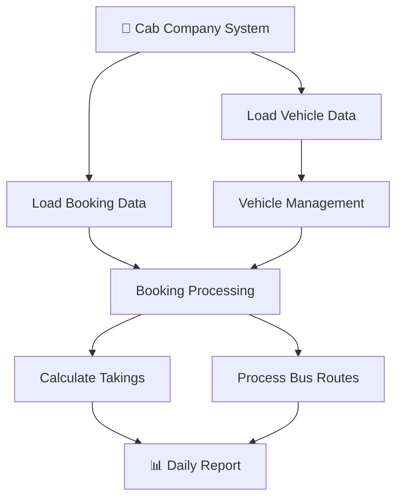

# 🚕 Cab Company Management System

A Java-based transport management system that models vehicles, bookings, routes and daily takings using object-oriented programming and data structures.

Built as a way to put Java fundamentals into practice, focusing on how different parts of a transport system work together.

---

### 🛠️ Tech Stack

[](https://www.java.com/)
[](https://en.wikipedia.org/wiki/Object-oriented_programming)
[](https://en.wikipedia.org/wiki/Data_structure)
[](https://en.wikipedia.org/wiki/Hash_table)
[](https://en.wikipedia.org/wiki/Array_(data_structure))
[](https://en.wikipedia.org/wiki/Comma-separated_values)

---

<div align="center">

**[🚕 View Repository](https://github.com/fentiogbue13-web/cab-company-management-system)** | **[💻 View Source Code](https://github.com/fentiogbue13-web/cab-company-management-system)**

</div>

---

## 🎯 The Challenge

I wanted to build something that would push me beyond writing individual Java classes and actually make me think about how a complete system should be structured.

The main challenge was designing the system so that different types of vehicles could behave differently while still being managed through the same overall company system.

That meant thinking about:

- How should different vehicle types share common behaviour?
- How can I avoid duplicating logic between cabs and buses?
- What data structures make sense for finding vehicles quickly?
- How should bus routes handle reaching the end of a route?
- How can booking information be read and processed from CSV files?

The result is a small transport management system built around object-oriented design, data structures and file handling.

---

## ⚙️ How The System Works

The system manages two main types of vehicles: **cabs and buses**.

Rather than treating them as completely separate objects, I created an abstract `Vehicle` superclass containing the shared structure that both vehicle types need.

`Cab` and `Bus` then extend this class and provide their own behaviour where needed.

This means the company can work with vehicles generally while still allowing individual vehicle types to behave differently.

The system also handles booking information from CSV files and uses that data to calculate takings and produce daily reports.

For buses, I also implemented circular route logic so that once the end of a route is reached, the route can wrap back around to the beginning.

---

## 🔄 System Workflow



---

## 🧠 Object-Oriented Design

One of the main things I wanted to practise with this project was using OOP concepts together in a realistic system rather than just demonstrating them individually.

### Abstraction

`Vehicle` is an abstract superclass containing the common structure shared by different vehicles.

This gives the rest of the system a consistent way of working with vehicles without needing to know every detail about a specific vehicle type.

### Inheritance

`Cab` and `Bus` both inherit from `Vehicle`.

This lets them reuse shared functionality while still having their own specific behaviour.

### Polymorphism

Different vehicle types can provide their own implementation of fare/takings behaviour.

The company can therefore work with a general `Vehicle` reference while the correct behaviour is used depending on the actual vehicle.

This was one of the parts of the project that helped OOP make more sense to me — especially seeing how inheritance and polymorphism can make a larger program easier to organise.

---

## 📊 Data Structures & Efficiency

I also wanted the project to make me think about **how data is stored and accessed**, rather than just making the system work.

### HashMap

Vehicles are stored using a `HashMap`, allowing them to be looked up using their registration number.

This gives an average **O(1)** lookup time, meaning the system does not need to search through every vehicle whenever it needs to find one.

### Circular Arrays

Bus routes use circular-array logic to handle wrap-around routes.

Instead of stopping when the route reaches its final position, the logic allows it to return to the beginning and continue from there.

This was a useful way of applying data structures to an actual problem rather than just using them because they were part of the coursework.

---

## 📂 The Data

The system works with booking and vehicle information stored in CSV files.

This gave me the opportunity to practise working with data outside of the Java source code itself.

The system can:

- Read booking information from CSV files
- Parse the data into usable values
- Match bookings to vehicles
- Process vehicle activity
- Calculate daily takings
- Generate daily reports

---

## 🛠️ Stack

| What | Why |
|---|---|
| **Java** | Main language used to build the system |
| **Object-Oriented Programming** | Used for abstraction, inheritance, encapsulation and polymorphism |
| **HashMap** | Efficient vehicle lookup |
| **Arrays** | Used for route and vehicle-related data |
| **CSV** | Input format for booking and vehicle data |
| **Data Structures** | Used to organise and process information efficiently |

---

## 💡 Why This Matters

✅ **It's more than individual classes.** The project brings multiple Java concepts together into one working system.

✅ **The OOP is actually used.** Abstraction, inheritance and polymorphism all have a purpose within the system rather than being included just to demonstrate them.

✅ **Efficiency matters.** Using a `HashMap` for vehicle lookup gave me a practical reason to think about time complexity and choosing appropriate data structures.

✅ **The data is external.** Working with CSV files meant the system had to process information rather than relying entirely on hard-coded values.

✅ **It helped me think about system design.** I had to consider how vehicles, bookings, routes and reports should interact rather than treating each part as a separate programming exercise.

---

## 📚 What I Learned

- **Object-oriented design** — Understanding how abstraction, inheritance and polymorphism can work together in a larger Java program.
- **Data structures** — Seeing how the choice of a data structure can affect how efficiently information can be accessed.
- **Time complexity** — Using `HashMap` gave me a practical example of why efficient lookup matters.
- **File handling** — Working with CSV files and turning external data into something the program can process.
- **Problem-solving** — Working through how different parts of the system should interact and handling things like circular routes.
- **System structure** — Learning that writing code that works is only part of the job; how the code is organised matters too.

---

## ▶️ How to Run

Clone the repository and open the project in a Java-compatible IDE.

The main Java files are:

```text
Booking.java
Bus.java
Cab.java
CabCompany.java
Main.java
Vehicle.java
```

---

<div align="center">

**Built with Java | Object-Oriented Design | Data Structures**

*A complete transport management system, from concept to completion.*

</div>
